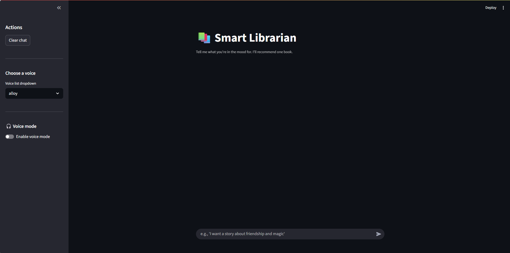

# Smart Librarian

*A modern AI-powered book recommendation chatbot with RAG, tool-called summaries, Text-to-Speech, and Speech-to-Text (upload) — built with Streamlit, OpenAI, and ChromaDB.*

<p>
  
  
  
  
</p>



---

## Features

- **Semantic Book Search (RAG):** Uses OpenAI embeddings + ChromaDB to retrieve **top-k** relevant books by theme/context, then recommends **top-1**.
- **Conversational Recommendation:** Short, friendly response from the chat model (non-streaming).
- **Tool-Called Detailed Summary:** After recommending a title, the app calls `get_summary_by_title(title)` to display the full local summary.
- **Moderation Guard:** OpenAI Moderation + small local fallback; flagged messages never reach the LLM.
- **Text-to-Speech (TTS):** On-click “Listen” buttons for both the short recommendation and detailed summary. Audio is cached to `data/audio/`. Sidebar **voice selector** included.
- **Speech-to-Text (STT, upload):** Upload `wav/mp3/m4a/webm`, transcribe via `whisper-1`, edit transcript, then **Use this text** to send it.
- **Debugging Aid:** An expander shows retrieved candidates (rank, distance) and the short context fed to the LLM.
- **Future Work:** Optional image generation for covers/scenes.

---

## Quickstart (Windows)

```powershell
# 1) Create & activate a virtual environment
python -m venv .venv
.venv\Scripts\activate

# 2) Install dependencies
pip install -r requirements.txt

# 3) Set your OpenAI API key (OS-level; open a new terminal after running)
setx OPENAI_API_KEY sk-your_key_here

# 4) Ingest the dataset into Chroma (first run only)
.\scripts\ingest.ps1

# 5) Launch the app
streamlit run app/app_streamlit.py
```

Open the app in your browser (usually http://localhost:8501).

---

## Project Structure

```
app/
  guards/
    moderation.py               # OpenAI moderation + local fallback
  llm/
    openai_client.py            # Shared OpenAI client
  rag/
    ingest.py                   # Build embeddings & upsert into Chroma
    retriever.py                # Semantic search (top-k)
    prompts.py                  # System/assistant templates
  tools/
    summaries_store.py          # Read/write local book summaries
    summary_tool.py             # get_summary_by_title(...) tool
    tts.py                      # Text-to-Speech with caching
    stt.py                      # Speech-to-Text (file uploads)
    image_gen.py                # (future) image generation
  app_streamlit.py              # Main UI
  config.py                     # Models, paths, knobs
data/
  book_summaries.json           # Source dataset (min. 10 books)
  chroma_store/                 # Vector DB files
  audio/                        # Cached TTS audio
  mic/                          # Uploaded / recorded audio (STT)
images/
  Streamlit_UI.png              # Screenshot for README
scripts/
  ingest.ps1                    # Convenience script for ingestion
requirements.txt
README.md
```

---

## Configuration

You can configure the app via **environment variables** (recommended on Windows) or an optional `.env` file. An example file is included as **`.env.example`**.

| Variable | Default | Purpose |
|---|---|---|
| `OPENAI_CHAT_MODEL` | `gpt-4o-mini` | Chat model for the short recommendation |
| `OPENAI_EMBEDDING_MODEL` | `text-embedding-3-small` | Embeddings for RAG |
| `OPENAI_TTS_MODEL` | `gpt-4o-mini-tts` | Text-to-Speech model |
| `OPENAI_TTS_VOICE` | `alloy` | Default TTS voice (also selectable in sidebar) |
| `OPENAI_TTS_FORMAT` | `mp3` | TTS audio format (cached in `data/audio/`) |
| `OPENAI_STT_MODEL` | `whisper-1` | Speech-to-Text model for uploads |
| `RETRIEVER_TOP_K` | `5` | Retrieve k candidates; recommend the first |
| `CHROMADB_PATH` | `./data/chroma_store` | Local Chroma storage path |
| `BOOK_SUMMARIES_PATH` | `./data/book_summaries.json` | Source dataset path |

**Note (Windows env):** after `setx OPENAI_API_KEY ...`, close and reopen your terminal so Streamlit sees the new variable.

---

## How Embedding Is Used

- Each book in `data/book_summaries.json` is embedded into a semantic vector using OpenAI.
- User queries are embedded the same way.
- ChromaDB performs **cosine similarity** search to find the closest matches, which supports theme-level queries (e.g., *friendship*, *war stories*, *magic*).
- The app takes **top-k** results for debugging and picks **top-1** for the recommendation.

---

## How It Works (Pipeline)

1. **Ingest** → read JSON → embed → upsert into **ChromaDB**.  
2. **Retrieve** → query → top-k semantic matches.  
3. **Recommend** → use top-1 → generate a short conversational blurb.  
4. **Tool** → `get_summary_by_title(title)` → show full summary from local store.  
5. **TTS** → on click, synthesize MP3 for either the short rec or full summary.  
6. **STT (upload)** → transcribe → edit transcript → **Use this text** → send to chat.

---

## Example Usage

**Text query**
```
User: I want a book about friendship and magic.
Bot : (recommends a top-1 title) + short conversational reason.
      (then shows a detailed summary via the tool)
```

**Audio query (upload)**
1. Open the **Voice mode** panel in the sidebar.  
2. Upload a short audio file (`wav/mp3/m4a/webm`).  
3. Click **Transcribe upload** → transcript appears. Edit if needed.  
4. Click **Use this text** to send it as the user query.

**Listen to responses**
- Click **Listen to recommendation** or **Listen to summary**.  
- Audio files are cached under `data/audio/`.

---

## Add More Books

1. Open `data/book_summaries.json`.  
2. Append entries with fields:
   ```json
   { "title": "Your Book Title", "summary": "3–5 lines with main themes." }
   ```
3. Re-run ingestion:
   ```powershell
   .\scripts\ingest.ps1
   ```

---

## Requirements

- **Python 3.12+**
- **OpenAI API key** (`OPENAI_API_KEY`)
- **ChromaDB** (installed via `requirements.txt` for local vector store)

---

## Acknowledgments

- **OpenAI** — Chat, Embeddings, Moderation, TTS, and Whisper STT  
- **ChromaDB** — Vector store for fast semantic retrieval  
- **Streamlit** — Simple, effective UI for rapid prototyping
